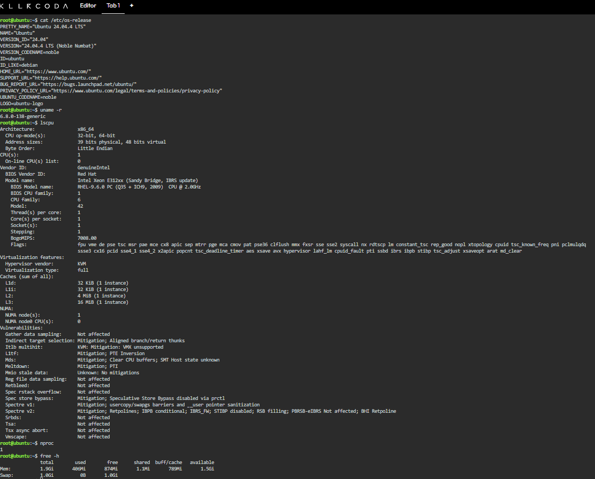
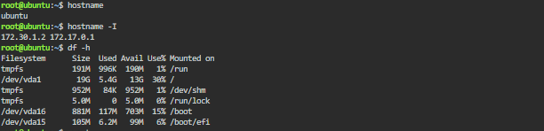
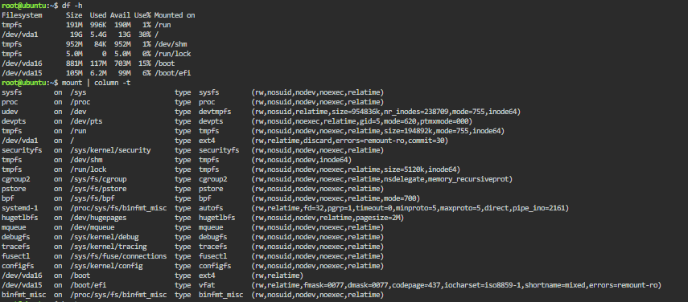

# Infrastructure Report

## Overview

This report documents the technical specifications of the Linux server
provisioned through the KillerCoda Playground, as part of the Cloud
Infrastructure Assessment for CloudNova Technologies.

---

## System Summary

| Attribute | Value |
|---|---|
| Operating System | Ubuntu 24.04.4 LTS (Noble Numbat) |
| Kernel Version | 6.8.0-138-generic |
| Hostname | ubuntu |
| IP Address | 172.30.1.2 (internal), 172.17.0.1 |
| Architecture | x86_64 |

---

## CPU Information

| Attribute | Value |
|---|---|
| CPU Model | Intel Xeon E312xx (Sandy Bridge, IBRS update) |
| Vendor | GenuineIntel |
| Number of CPU Cores | 1 |
| Threads per Core | 1 |
| Core(s) per Socket | 1 |
| Socket(s) | 1 |
| Clock Speed | ~2.0 GHz (BogoMIPS: 7008.00) |
| Virtualization | KVM (Full virtualization) |
| L1d Cache | 32 KiB |
| L1i Cache | 32 KiB |
| L2 Cache | 4 MiB |
| L3 Cache | 16 MiB |

> **Note:** This is a virtualized CPU (running under KVM), which is typical
> for cloud/sandbox environments like KillerCoda — the underlying physical
> hardware is shared and abstracted away from the user.

---

## Memory (RAM)

| Type | Total | Used | Free | Buff/Cache | Available |
|---|---|---|---|---|---|
| Memory | 1.9 Gi | 414 Mi | 837 Mi | 820 Mi | 1.5 Gi |
| Swap | 1.0 Gi | 0 B | 1.0 Gi | — | — |

---

## Disk Capacity

| Filesystem | Size | Used | Available | Use% | Mounted on |
|---|---|---|---|---|---|
| tmpfs | 191M | 996K | 190M | 1% | /run |
| /dev/vda1 | 19G | 5.4G | 13G | 30% | / |
| tmpfs | 952M | 84K | 952M | 1% | /dev/shm |
| tmpfs | 5.0M | 0 | 5.0M | 0% | /run/lock |
| /dev/vda16 | 881M | 117M | 703M | 15% | /boot |
| /dev/vda15 | 105M | 6.2M | 99M | 6% | /boot/efi |

**Main storage disk:** `/dev/vda1` — 19GB total, 30% used, mounted as the
root filesystem (`/`).

---

## Mounted File Systems

| Mount Point | Device/Source | Filesystem Type | Notes |
|---|---|---|---|
| `/` | /dev/vda1 | ext4 | Root filesystem — main OS storage |
| `/boot` | /dev/vda16 | ext4 | Boot files |
| `/boot/efi` | /dev/vda15 | vfat | EFI system partition |
| `/dev/shm` | tmpfs | tmpfs | Shared memory (RAM-backed) |
| `/run` | tmpfs | tmpfs | Runtime data (RAM-backed) |
| `/sys`, `/proc` | sysfs, proc | virtual | Kernel/system interfaces (not real storage) |

> Only `/`, `/boot`, and `/boot/efi` are actual disk-backed filesystems.
> The `tmpfs`/`sysfs`/`proc` entries are virtual filesystems that live in
> RAM or are kernel interfaces — they don't use physical disk space.

---

## Screenshots

---

## Summary

The server is a single-core Ubuntu 24.04 LTS instance running on KVM
virtualization, with 1.9GB of RAM and 19GB of primary disk storage (13GB
available). This matches the typical footprint of a lightweight cloud
sandbox instance — enough resources to run basic services and demonstrate
core Linux/cloud concepts, but not intended for production workloads.